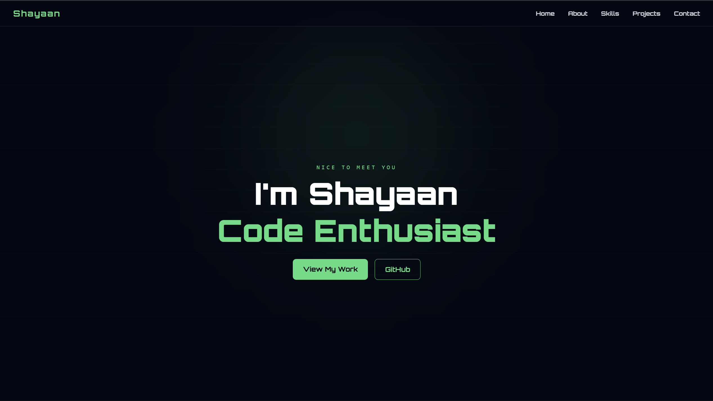

# Personal Portfolio - Shayaan Ahmed

A dark themed developer portfolio built from scratch.
Showcasing my skills, projects, and ways to get in touch.

---

## Built with

- HTML
- CSS (custom + tailwind css)
- Javascript (vanilla)
- AOS
- Formspree
- Google Font

---

## Project Structure

.
├── index.html
├── images/
│   ├── excel.webp
│   ├── word.webp
│   ├── ppt.webp
│   └── profile.jpg
├── styles/
│   ├── style.css
│   ├── nav-style.css
│   ├── home-style.css
│   ├── about-style.css
│   ├── skills-style.css
│   ├── projects-style.css
│   └── contact-style.css
└── scripts/
    ├── script.js
    ├── navbar.js
    ├── home.js
    └── contact.js

---

## Features

- Responsive design across all screen sizes
- Smooth scroll animation via AOS
- Typewritter effect on home section
- Working contact form with success/error feedback
- Clean dark-mode with green theme

---

> Built By Shayaan · 2026
